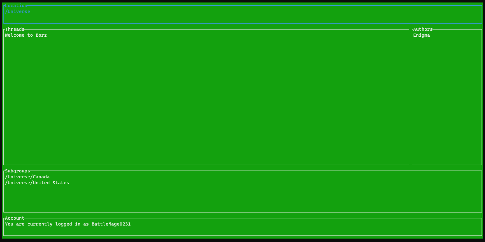

# borz-client
A command line interface for the Borz social networking platform



## Description
This repository stores a CLI-based client for the Borz social networking and forums platform. Borz features organization hierachies rather than linear organizations in other platforms. This client is platform-independent and allows you to connect to any instance of the server provided its address. 

## Getting Started

### Installing

#### Building from source
This project is written in Rust, so you'll need to download that in order to build from source. After you have installed Rust, you can run the following commands.

```sh
cargo build --release
```

### Running the program
To run the program, you have to first log in into an account managed by the instance of the server you specified. When you are prompted the for the server address, you may enter "https://api.borz.paullee.dev/graphql" for our hosted server.

```sh
borz signup
borz verify
borz login
```

Then, once you have logged in, you can run the program just by running the executable without subcommands.

### Using the client
Once you start the client, you'll be placed in a home page which is really just a group of all top-level groups. You can navigate the menu with the tab key and use arrow keys to move around. If you press enter on a subgroup, it will take you into that subgroup. If you press enter on a thread name or an author name, it will take you to the thread or the author's profile. You may press escape to go back to the previous screen.

In the thread menu, you can navigate the messages widget using arrow keys. If you go beyond the rightmost message, you will be put into reply mode, where you can type a message. You may type only ASCII alphanumeric characters and punctuation. Pressing enter will insert a new line at your caret.Pressing backspace will pop your current line. Pressing insert will attempt to send the message.
